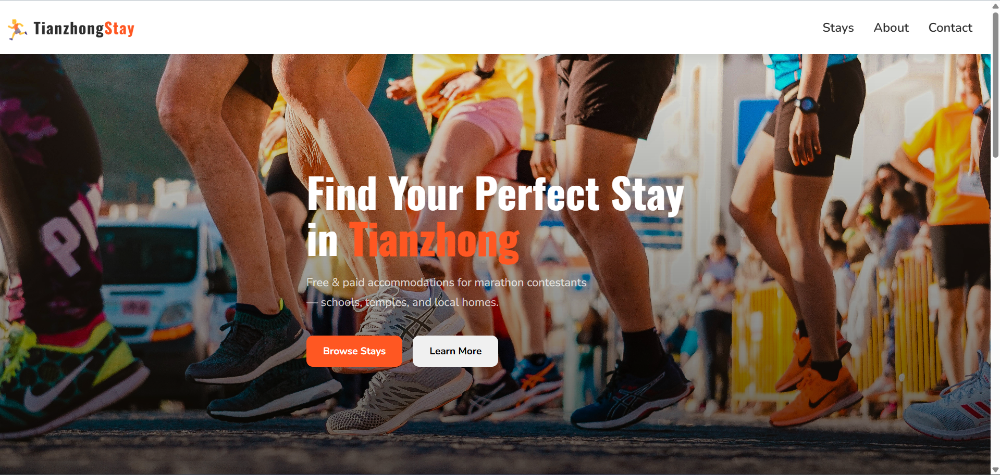

# 🏃 Tianzhong Stay

A web platform for marathon participants to find free or paid accommodations near the race location, including community spaces like schools and temples.

## 🌐 Live Demo

[Repositories](https://github.com/3706188/Tianzhong-accommodation)

[Live Site URL](https://3706188.github.io/Tianzhong-accommodation/)

## 📸 Screenshots



## ✨ Features

- Browse available stays (free & paid)
- Filter by category (Free / Paid)
- Search by name, address, or description
- View detailed information for each stay
- Responsive design for mobile and desktop

## 🛠️ Built With

- HTML5
- CSS3 (Grid, Flexbox, Media Queries)
- Vanilla JavaScript (DOM manipulation, URL params)

## 🚀 Getting Started

Clone the repo and open `index.html` in your browser.

```bash
git clone https://github.com/3706188/Tianzhong-accommodation.git
```

## 👨‍💻 Author

Yoyo — [GitHub](https://github.com/3706188)
